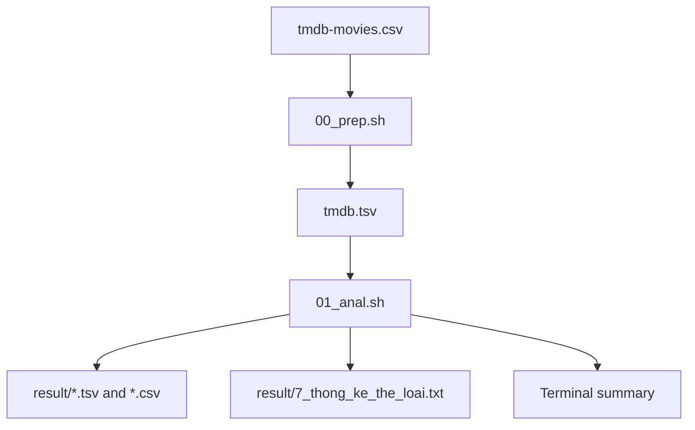

<h1 align="center">TMDB Movie Data Analysis</h1>
<p align="center">
  Prepare and explore a movie dataset with Bash, awk, and standard Linux command line tools.
</p>
<p align="center">
  
  
  
  
</p>
<p align="center">
  <a href="#overview">Overview</a> ·
  <a href="#quick-start">Quick Start</a> ·
  <a href="#analysis-tasks">Analysis Tasks</a> ·
  <a href="#results">Results</a> ·
  <a href="#project-files">Project Files</a>
</p>

---

## Overview
This project analyzes the included `tmdb-movies.csv` using shell scripts. The preparation script converts quoted, sometimes multiline CSV records into a 21 columns TSV and normalizes release dates to `YYYY-MM-DD`. The analysis script then answers seven movie data questions and exports selected results as TSV and CSV.
> **Reproducible run:** Use the two scripts below from the extracted repository. The archive also contains older files under `result/`, `q1.tsv`, and `q2.tsv` that do not all match a fresh run.

## Highlights
| | Stage | What it does |
|:---:|---|---|
| 🧹 | Prepare | Reconstruct multiline CSV records, handle quoted commas, normalize dates, and export TSV |
| 🔎 | Filter | Select movies with an average rating above 7.5 |
| 📊 | Aggregate | Summarize revenue, estimated profit, people, and genres |
| 📁 | Export | Write sorted and filtered TSV and CSV files, plus genre counts |
| ✅ | Check | Report invalid column counts and date/year mismatches during preparation |

---

## Quick Start
### Requirements
- Bash and common command-line utilities: `awk`, `sort`, `uniq`, `head`, `tail`, `wc`, and `tr`-compatible shell tools.
- A Linux environment, macOS with compatible command line tools, or WSL on Windows.
- The included `tmdb-movies.csv` in the repository root.

No Python packages, database, or network access are needed to run the scripts.

### Run the pipeline
From the extracted project directory:
```sh
bash 00_prep.sh
bash 01_anal.sh
```

The scripts switch to their own directory before reading files, so they can also be invoked using their paths from another directory. To keep a copy of the full terminal report:
```sh
bash 01_anal.sh > analysis.log 2>&1
```

> `00_prep.sh` has no shebang in the supplied source. Invoke it with `bash` as shown above. The analysis script may print harmless `sort: ... Broken pipe` messages when a sorted stream is piped to `head`.

<details>
<summary><strong>Check the prepared dataset</strong></summary>

```sh
head -1 tmdb.tsv | tr '\t' '\n'
wc -l tmdb.tsv
ls result/
```

On the supplied dataset, preparation reports **10,866 movies**, **21 fields per row**, **zero rows with an unexpected field count**, and **zero release-date/year mismatches**. `wc -l tmdb.tsv` includes the header and returns 10,867.

</details>

---

## Data Flow


The original CSV has 21 columns, including `budget`, `revenue`, `original_title`, `cast`, `director`, `genres`, `release_date`, `vote_average`, and inflation-adjusted budget and revenue fields. The scripts address these columns by position in the prepared TSV.

## Analysis Tasks
| # | Question | Method or output |
|:---:|---|---|
| 1 | Which movies were released most recently? | Sort normalized release dates descending; save all rows. |
| 2 | Which movies have an average rating above 7.5? | Numeric filter on `vote_average`; save matching rows. |
| 3 | Which movies have the highest and lowest revenue? | Rank nominal revenue; show zero and positive-revenue cases separately. |
| 4 | What is the sum of movie revenue? | Sum nominal revenue and inflation-adjusted revenue. |
| 5 | Which movies have the highest estimated profit? | Rank `revenue - budget`; also show an adjusted comparison. |
| 6 | Which directors and cast members appear most often? | Split pipe-separated names and count occurrences. |
| 7 | How many movies belong to each genre? | Split pipe-separated genres and count occurrences. |

## Results
A fresh run of the supplied scripts on the included CSV produced:

| Measure | Verified result |
|---|---:|
| Movies prepared | 10,866 |
| Movies with `vote_average > 7.5` | 350 |
| Movies with recorded `revenue > 0` | 4,850 |
| Movies with `revenue = 0` | 6,016 |
| Total nominal revenue | 432,720,192,875 USD |
| Distinct genres in output | 20 |

These are dataset summaries, not performance benchmarks. A rating count does not imply a minimum number of votes. A revenue value of zero may represent missing data, so the script also reports the lowest **positive** revenue separately.

<details>
<summary><strong>Generated files and archived-result differences</strong></summary>

| Freshly generated path | Contents |
|---|---|
| `tmdb.tsv` | Normalized full dataset with a header |
| `result/1_sap_xep_theo_ngay.tsv` | Movies ordered by release date |
| `result/1_sap_xep_theo_ngay.csv` | CSV export of the same rows |
| `result/2_diem_tren_7.5.tsv` | Rating-filtered movies |
| `result/2_diem_tren_7.5.csv` | CSV export of the same rows |
| `result/7_thong_ke_the_loai.txt` | Movie counts by genre |

The archive's `report.md` and `result/2_diem_tren_7.5.tsv` describe **91** high-rated movies; its separate `q2.tsv` contains **1,282** data rows. The current `01_anal.sh` explicitly converts ratings to numbers and returns **350** matching movies when rerun. Treat generated `result/` files as the result of the current scripts.

</details>

---

## Project Files
| Path | Role |
|---|---|
| `00_prep.sh` | CSV to TSV preparation and data checks |
| `01_anal.sh` | Seven analysis tasks and exports |
| `tmdb-movies.csv` | Supplied source dataset |
| `tmdb.tsv` | Bundled prepared dataset; regenerated by the prep script |
| `result/`, `q1.tsv`, `q2.tsv`, `q7.txt` | Earlier saved outputs in the archive |
| `report.md` | Earlier written report; some numbers differ from a fresh run |
| `command_history.txt` | Recorded exploratory shell commands |
| `test/` | Notebook and data copies; not used by the two-script workflow |

## Known Limitations
- The CSV preparation script uses quote parity to reconstruct records. It is tailored to the supplied dataset and is not a general-purpose RFC 4180 CSV parser.
- Analysis uses fixed TSV column positions and assumes the same 21-column schema.
- Profit is calculated as `revenue - budget`; it does not include marketing, distribution, or other costs.
- A movie can have multiple genres or cast members, so category and person counts are occurrences rather than distinct-movie totals across all categories.
- Some archived outputs and the older report do not match the current scripts; rerun both scripts when quoting results.

## Roadmap
- Add a small fixture and automated checks for quoting, multiline fields, and numeric rating comparisons.
- Save a machine-readable summary alongside the exported tables.
- Make the CSV preparation step robust for arbitrary valid CSV input.
- Align or remove old reports and output files after confirming the intended results.

## Contributing
Submit an issue or a focused pull request with a small input example, expected output, and commands used to verify the change.

## License
No license file is included in the supplied archive. Confirm permissions for both code and dataset before redistribution.

---

<p align="center"><a href="#tmdb-movie-data-analysis">Back to top ↑</a></p>
